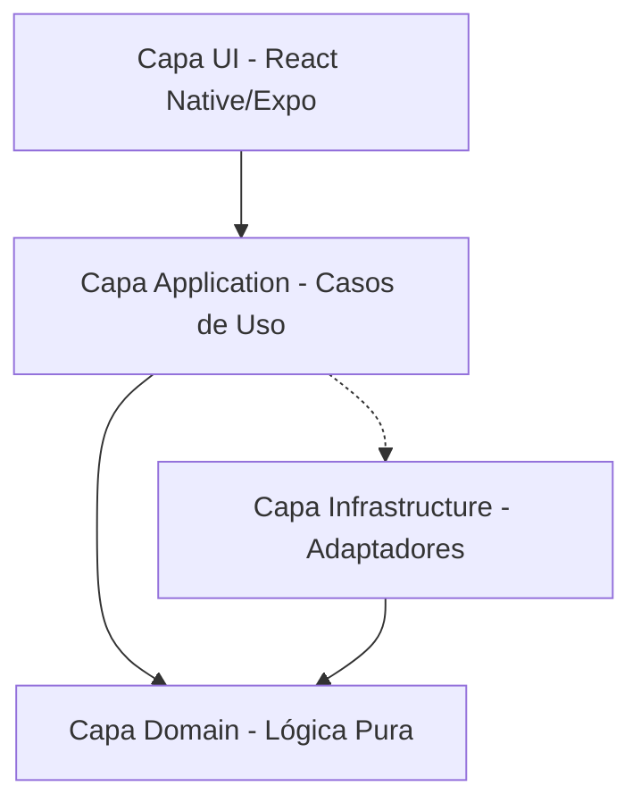
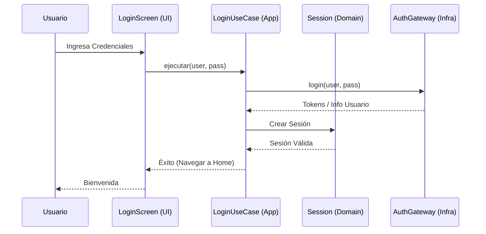

# Medá Agentes (v2) - Gestión de Migración y Harness Engineering

Este documento describe la arquitectura detallada, el estado de la migración y el marco de trabajo para agentes (Harness Engineering).

## 🚀 Estado de la Migración (Legacy -> v2)

| Módulo Legacy                | Estado v2      | Capa en v2                                          |
| :--------------------------- | :------------- | :-------------------------------------------------- |
| Login / Auth / Recovery      | ✅ Migrado     | `domain/auth`, `ui/features/auth`                   |
| Account / Profile            | 🟡 En progreso | `domain/account`, `ui/features/account`             |
| Notifications                | 🟡 En progreso | `domain/notifications`                              |
| Wallet                       | 🟡 En progreso | `domain/wallet`                                     |
| Support / FAQ / Help         | 🟡 En progreso | `domain/support`                                    |
| Beneficiaries                | ✅ Migrado     | `domain/beneficiaries`, `ui/features/beneficiaries` |
| Fiscal                       | ❌ Pendiente   | -                                                   |
| Prospect                     | ❌ Pendiente   | -                                                   |
| SOD (Sistema de Operaciones) | ❌ Pendiente   | -                                                   |

> [!IMPORTANT]
> El repositorio `medaapp-v2` es ahora el controlador principal de la aplicación. El código legacy se usa únicamente como referencia técnica para asegurar la paridad de reglas de negocio.

## 🏗️ Arquitectura del Sistema

Utilizamos **Arquitectura Hexagonal (Clean Architecture)** para garantizar que la lógica de negocio sea independiente de frameworks, UI y bases de datos.

### Diagrama de Capas

### Descripción de Archivos y Carpetas

- **`src/domain/`**: El corazón de la aplicación. Contiene Entidades y Puertos (interfaces). No tiene dependencias externas.
  - _¿Por qué?_ Permite que la lógica sea testeable y portable a futuro (Kotlin/Swift).
- **`src/application/`**: Implementa los Casos de Uso que orquestan el dominio y los puertos.
  - _¿Por qué?_ Separa la intención del usuario de la implementación técnica (ej. "Iniciar Sesión").
- **`src/infrastructure/`**: Implementaciones técnicas (Adaptadores): API REST, Almacenamiento Local, Auth real.
  - _¿Por qué?_ Mantiene el framework y las librerías de terceros lejos del negocio.
- **`src/ui/`**: Componentes visuales (Atomic Design), navegación y estado de UI.
  - _¿Por qué?_ Centraliza todo lo que el usuario ve y toca.
- **`src/composition/`**: Contenedor de Inyección de Dependencias.
  - _¿Por qué?_ Aquí se "ensambla" toda la aplicación (une puertos con adaptadores). Es el único lugar con acoplamiento total.
- **`src/config/`**: Variables de entorno y constantes globales.
  - _¿Por qué?_ Control centralizado de configuraciones.

## 🔄 Flujos Críticos (Diagramas de Secuencia)

### Flujo de Autenticación (Login)

## 🛠️ Harness Engineering (Sistema de Agentes)

El contrato canonico para agentes esta en `AGENTS.md`. Claude, Codex y cualquier otro LLM deben leerlo antes de trabajar y usar las personas/protocolos de `.agents/harness/`.

### Roles de Agentes

1.  **Orquestador**: coordina contexto, spec, implementacion, revisiones y cierre.
2.  **Legacy Expert**: extrae reglas, endpoints, payloads y edge cases desde `../medaapp`.
3.  **Planner**: convierte la solicitud en spec tecnica por capas.
4.  **RN Developer**: implementa con Expo, React Native, TypeScript y arquitectura hexagonal.
5.  **Tester & QA**: ejecuta Quality Gate, valida paridad y reporta regresiones.
6.  **UI/UX Auditor**: revisa usabilidad, accesibilidad, estados y consistencia visual.
7.  **Performance Specialist**: evalua renders, listas, memoria, red, startup y escalabilidad.

### Proceso de Revisión

1.  **Activación**: leer `AGENTS.md` y seleccionar workflow/personas.
2.  **Contexto**: revisar repo, scripts, patrones existentes y legacy si aplica.
3.  **Planificación**: crear spec y Sprint Contract cuando el cambio toque varias capas o reglas críticas.
4.  **Implementación**: trabajar de dominio hacia UI, con contratos y tests.
5.  **Validación**: ejecutar scripts relevantes y auditorías QA, UI/UX y performance.
6.  **Cierre**: reportar archivos, evidencias, riesgos y pendientes.

---

_Última actualización: 2026-06-09_
