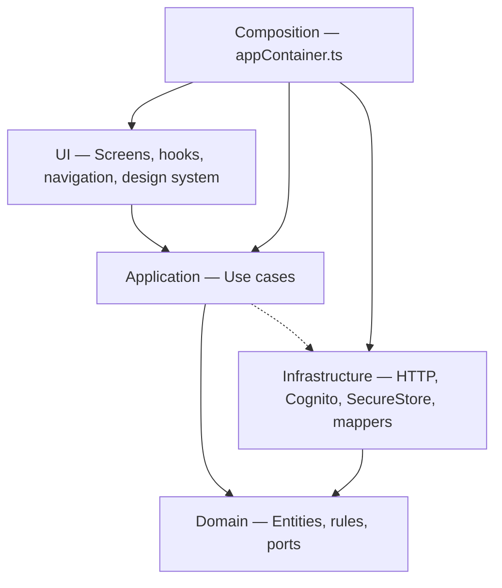
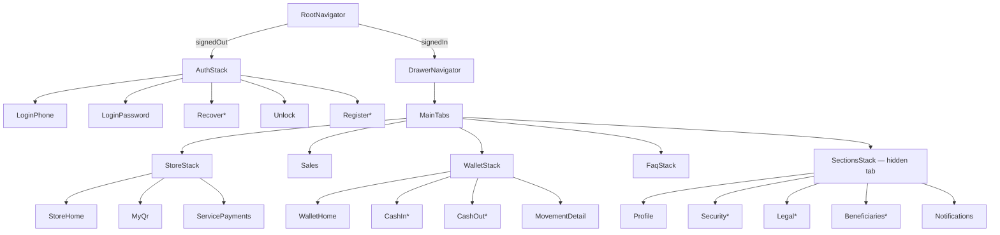
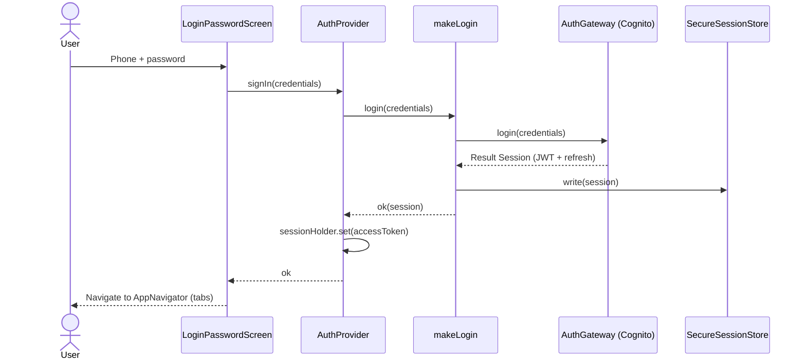
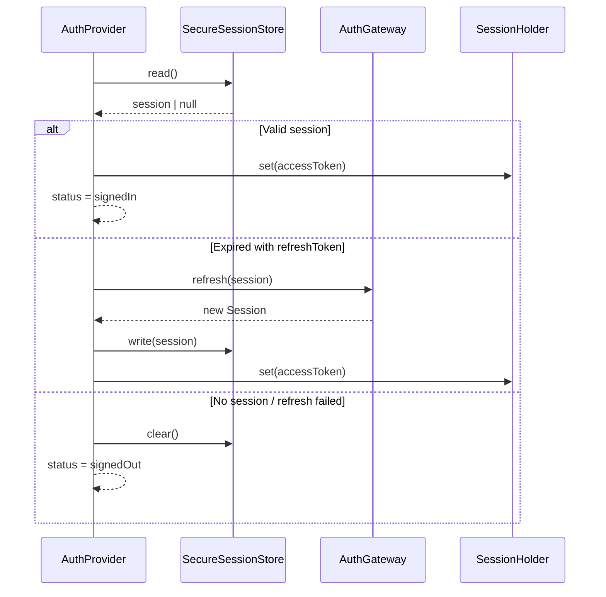
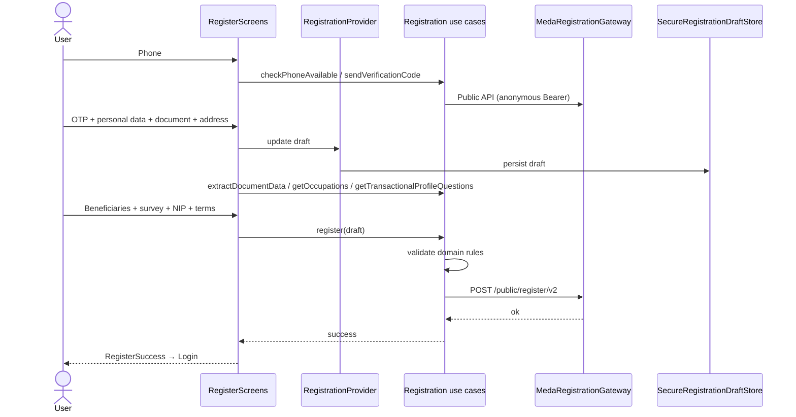
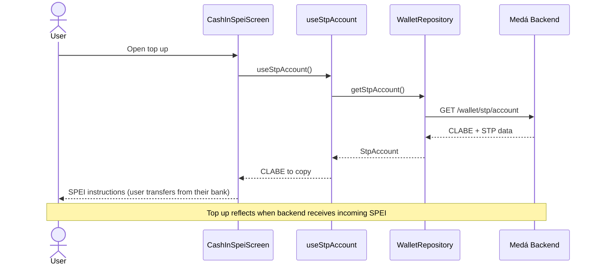
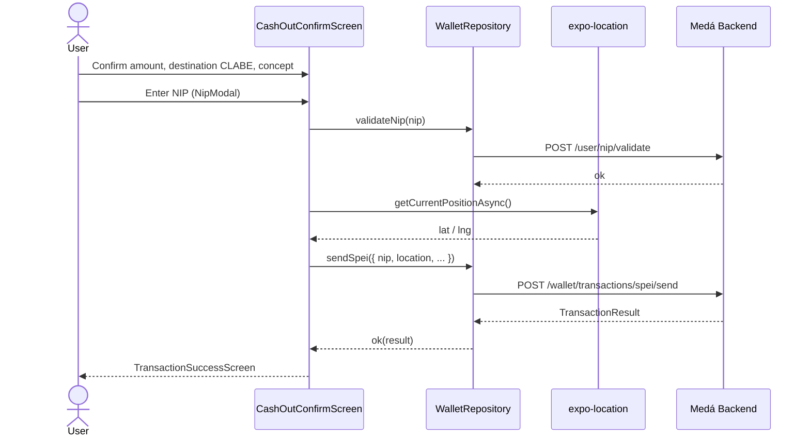
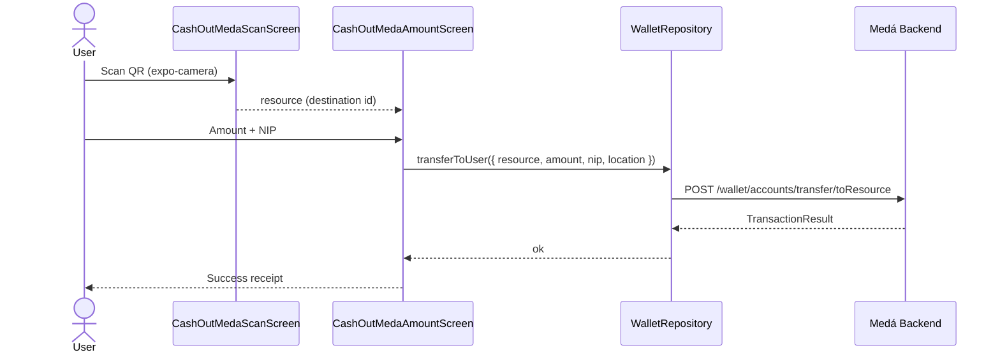
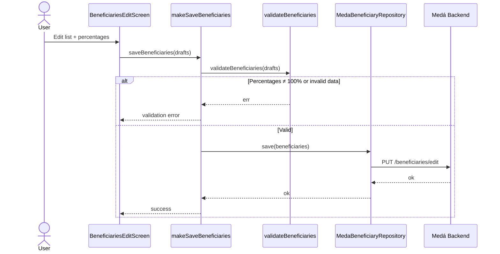
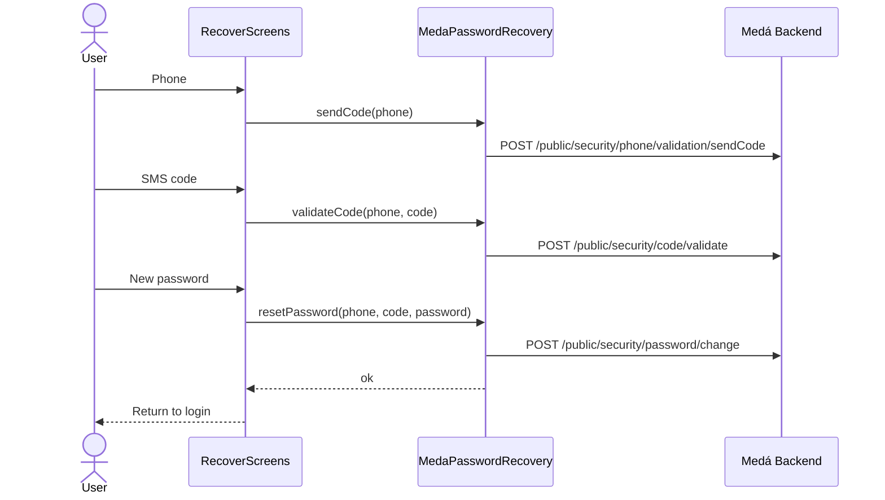

# Medá Fintech (v2)

Mobile digital wallet app for Medá agents, rebuilt with **Expo SDK 56**, **React Native 0.85**, and **hexagonal architecture**. This repository is the primary app codebase; legacy code (`../medaapp`) is used only as a functional parity reference.

---

## Table of contents

1. [Product overview](#product-overview)
2. [Tech stack](#tech-stack)
3. [Quick start](#quick-start)
4. [Architecture](#architecture)
5. [Migration status](#migration-status)
6. [Features and screens](#features-and-screens)
7. [Use cases](#use-cases)
8. [Navigation](#navigation)
9. [Sequence diagrams](#sequence-diagrams)
10. [Domain and application layer](#domain-and-application-layer)
11. [Backend integration](#backend-integration)
12. [Security and compliance](#security-and-compliance)
13. [Testing and Quality Gate](#testing-and-quality-gate)
14. [Build and deployment (EAS)](#build-and-deployment-eas)
15. [Harness Engineering](#harness-engineering)
16. [Production backlog](#production-backlog)

---

## Product overview

Medá Fintech enables agents to:

- Create an account and complete regulatory onboarding (KYC).
- Sign in, recover password, and unlock a locked account.
- View balance, transactions, and SPEI CLABE.
- Top up via SPEI and send money (SPEI to third parties or transfer to another Medá user via QR).
- Manage profile, security (password, NIP, email, phone), beneficiaries, and account statements.
- Browse FAQs, support chat, and in-app notifications.

The app requires an **active device location** and enforces **secure session** policies (inactivity timeout, network change).

---

## Tech stack

| Area | Technology |
| :--- | :--------- |
| Runtime | Expo `~56.0.8`, React Native `0.85.3`, React `19.2.3` |
| Language | Strict TypeScript |
| Navigation | React Navigation 7 (Stack, Tabs, Drawer) |
| Styling | NativeWind v4 + tokens in `src/ui/design-system` |
| Remote data | TanStack React Query v5 |
| Auth | AWS Cognito + OAuth2 client credentials (anonymous token) |
| Secure storage | `expo-secure-store` (session, registration draft) |
| Device APIs | `expo-location`, `expo-camera`, `expo-clipboard` |
| Animations | Reanimated 4 |
| Tests | Jest + jest-expo |

Required versioned docs: [Expo SDK 56](https://docs.expo.dev/versions/v56.0.0/).

---

## Quick start

### Requirements

- Node.js `22.13.x` or higher
- npm
- Expo CLI / EAS CLI for native builds
- Backend environment variables (see `.env.example`)

### Setup

```bash
cp .env.example .env
# Fill EXPO_PUBLIC_* with backend / AWS Cognito values
npm install
npm start
```

### Scripts

| Script | Description |
| :----- | :---------- |
| `npm start` | Expo development server |
| `npm run android` / `npm run ios` | Local native run |
| `npm run lint` | ESLint |
| `npm run typecheck` | Full TypeScript check |
| `npm run typecheck:domain` | Domain-only TypeScript (no React/Expo) |
| `npm test` | Jest |
| `npm run format:check` | Prettier |

---

## Architecture

**Hexagonal architecture (Clean Architecture)** with decoupled layers and dependency injection at the composition root.

### Layer diagram



### Repository structure

| Folder | Responsibility |
| :----- | :--------------- |
| `src/domain/` | Entities, value objects, business rules, and **ports** (interfaces). Pure TypeScript — no React or device APIs. |
| `src/application/` | **Use cases** that orchestrate domain and ports. |
| `src/infrastructure/` | Adapters: `HttpClient`, Medá repositories, Cognito, SecureStore, DTO mapping. |
| `src/ui/` | Feature screens, navigation, providers, UI hooks, design system. |
| `src/composition/` | `createAppContainer()` — single DI assembly point. |
| `src/config/` | `env.ts`, legal URLs, global constants. |

TypeScript aliases: `@domain/*`, `@application/*`, `@infrastructure/*`, `@ui/*`, `@composition/*`, `@config/*`.

### Root providers

`AppProviders` composes: gestures → DI container → SafeArea → Toast → React Query → Auth → Registration → SecurityMonitor → LocationGate → navigation.

---

## Migration status

Comparison against legacy (`../medaapp`):

| Module | v2 status | Layers / UI |
| :----- | :-------- | :---------- |
| Login / Auth / Recovery / Unlock | ✅ Migrated | `domain/auth`, `application/auth`, `ui/features/auth` |
| Registration / Prospect (KYC onboarding) | ✅ Migrated | `domain/registration`, `application/registration`, `ui/features/auth` + `RegistrationProvider` |
| Beneficiaries | ✅ Migrated | `domain/beneficiaries`, `application/beneficiaries`, `ui/features/beneficiaries` |
| Wallet (balance, movements, SPEI, QR) | ✅ Migrated | `domain/wallet`, `infrastructure/wallet`, `ui/features/wallet` |
| Account / Profile / Security | ✅ Migrated | `domain/account`, `infrastructure/account`, `ui/features/account` |
| In-app notifications | ✅ Migrated | `domain/notifications`, `ui/features/notifications` |
| Support / FAQ / Chat | ✅ Migrated (clarifications: placeholder) | `domain/support`, `ui/features/support` |
| Home / My expenses / My QR | ✅ Migrated | `ui/features/home`, `ui/features/wallet` |
| Service payments | 🟡 Implemented, restricted access | UI in `ServicePaymentsScreen`; Home shortcut shows maintenance modal |
| Push notifications (FCM/APNs) | 🟡 Endpoint defined | `pushTokenSync` on backend; no Expo Notifications integration in UI |
| Fiscal | ❌ Pending | — |
| SOD (Operations System) | ❌ Pending | — |

---

## Features and screens

### Authentication (unauthenticated stack)

| Screen | Functionality |
| :----- | :------------ |
| `LoginPhone` | Captures phone and resolves name via public directory |
| `LoginPassword` | Cognito login; locked account and attempt handling |
| `RecoverPhone` / `RecoverCode` / `RecoverNewPassword` | Password recovery via SMS |
| `Unlock` | Account unlock with verification code |
| `RegisterPhone` → `RegisterSuccess` | Full 10-step onboarding (see registration flow) |

### Authenticated app — main tabs

| Tab | Screens | Functionality |
| :-- | :------ | :------------ |
| **Home** (`Store`) | `StoreHome`, `MyQr`, `ServicePayments*` | Dashboard: balance, quick actions, recent transactions, payment QR |
| **My expenses** (`Sales`) | `SalesScreen` | Period sales/expenses total |
| **My Wallet** (`Wallet`) | Wallet stack | Balance, CLABE, filterable movement list, top up, send |
| **Help** (`Faq`) | `FaqList`, `FaqDetail`, `Chat`, `Clarifications` | Searchable FAQs, detail, chat WebView, clarifications (placeholder) |

### Side drawer

- View my profile
- Legal documents and account statements
- Security
- Frequently asked questions
- Sign out

### Wallet — subflows

| Route | Description |
| :---- | :---------- |
| `CashInMethods` / `CashInSpei` | SPEI top-up instructions (CLABE) |
| `CashOutMethods` | Choose SPEI or send to Medá user |
| `CashOutSpeiForm` → `CashOutConfirm` → `TransactionSuccess` | SPEI send with NIP and location validation |
| `CashOutMedaScan` → `CashOutMedaAmount` | QR scan + transfer between Medá users |
| `MovementDetail` | Transaction detail |

### Account and security (`Sections` stack)

| Route | Description |
| :---- | :---------- |
| `Profile` | Personal data, CURP, contact info |
| `Notifications` | List and mark as read |
| `Legal` / `PdfViewer` | Terms, privacy, fees, contract |
| `Statements` | Account statements + PDF download with NIP |
| `Beneficiaries` / `BeneficiariesEdit` | View and edit with percentage validation |
| `Security` | Security options hub |
| `ChangePassword`, `ChangeNip`, `SetNip` | Credentials and 6-digit NIP |
| `ChangeEmail`, `ValidateEmail` | Email change and validation |
| `ChangeNumber` | Phone change with OTP + NIP |
| `CancelAccount` | Account cancellation with CLABE disbursement |

---

## Use cases

### Application layer (factories in `appContainer`)

| Use case | Factory | Description |
| :------- | :------ | :---------- |
| Login | `makeLogin` | Authenticates with Cognito and persists session in SecureStore |
| Name lookup | `makeLookupUserName` | Fetches public name by phone before login |
| List beneficiaries | `makeListBeneficiaries` | Fetches user beneficiaries |
| Save beneficiaries | `makeSaveBeneficiaries` | Validates domain rules and persists |
| Postal code lookup | `makeLookupPostalCode` | Colony catalog by postal code |
| Check registration phone | `makeCheckPhoneAvailable` | Availability + local validation |
| Send registration OTP | `makeSendVerificationCode` | Verification SMS |
| Validate registration OTP | `makeValidateVerificationCode` | Confirms code |
| Required documents | `makeGetRequiredDocuments` | ID type by nationality/residency |
| Document OCR | `makeExtractDocumentData` | INE/passport data extraction |
| Transactional profile questions | `makeGetTransactionalProfileQuestions` | Regulatory survey |
| Occupations | `makeGetOccupations` | Occupation catalog |
| Register user | `makeRegister` | Validates full draft and submits v2 registration |

### Repositories (ports implemented in infrastructure)

| Port | Main operations |
| :--- | :-------------- |
| `AuthGateway` | login, refresh, logout |
| `PasswordRecovery` | sendCode, validateCode, resetPassword |
| `WalletRepository` | account, balance, STP CLABE, movements, categories/services, service payment, SPEI banks, validate NIP, send SPEI, transfer to resource |
| `AccountRepository` | profile, password/NIP/email/phone change, statements, PDF, beneficiaries, cancellation, unlock |
| `BeneficiaryRepository` | list, save, lookupPostalCode |
| `NotificationRepository` | list, markAsRead |
| `SupportRepository` | getFaqs |
| `RegistrationGateway` | full public signup flow |
| `SessionStore` | read / write / clear (SecureStore) |
| `RegistrationDraftStore` | multi-step registration draft |

### Notable domain rules

- **Session**: expiration, refresh with 60 s skew (`SessionManager`).
- **Registration**: phone, OTP, password (no personal data), 6-digit NIP, legal acceptance validation.
- **Beneficiaries**: percentages must sum to 100%, valid names, 5-digit postal code.
- **Money**: formatting and utilities in `domain/shared/money.ts`.
- **Movements**: grouping, expense totals (`Movement`).

---

## Navigation



---

## Sequence diagrams

### 1. Sign in



### 2. Session restore on app launch



### 3. New user registration (onboarding)



### 4. Top up (Cash In SPEI)



### 5. Send money SPEI (Cash Out)



### 6. Transfer to Medá user (QR)



### 7. Beneficiary editing



### 8. Password recovery



---

## Domain and application layer

Main entities:

| Domain | Entities / types |
| :----- | :--------------- |
| `auth` | `Session`, `AnonymousToken` |
| `account` | `UserProfile`, `AccountStatement`, `Beneficiary` |
| `wallet` | `Account`, `Movement`, `Transfer`, `Category`, `Service` |
| `beneficiaries` | `Beneficiary`, `BeneficiaryDraft`, `PostalCodeInfo` |
| `registration` | `RegistrationDraft`, `REGISTRATION_STEPS` |
| `notifications` | `AppNotification` |
| `support` | `FaqItem` |
| `shared` | `Result<T,E>`, `money`, IDs |

Error pattern: all ports return typed `Result<T, Error>` (no opaque exceptions to UI).

---

## Backend integration

- **Base URL**: `EXPO_PUBLIC_API_BASE_URL` (see `.env.example`).
- **Public auth**: OAuth2 `client_credentials` → anonymous Bearer for `/public/*` endpoints.
- **User auth**: Cognito JWT in `Authorization` header for authenticated endpoints.
- **Endpoint catalog**: `src/infrastructure/http/endpoints.ts` (parity with legacy `apiEndpoints.js`).

HTTP authentication (`HttpClient`):

| Mode | Usage |
| :--- | :---- |
| `none` | OAuth token endpoint |
| `public` | Registration, FAQs, recovery, postal code |
| `user` | Wallet, account, notifications, beneficiaries |

---

## Security and compliance

| Control | Implementation |
| :------ | :------------- |
| Session | SecureStore + automatic refresh + gateway logout |
| Inactivity | 5 min without interaction → sign out (`SecurityMonitor`) |
| Network change | WiFi ↔ cellular with active session → sign out |
| Background | Return after ≥ 5 min in background → sign out |
| Location | Mandatory gate before using the app (`LocationGate`) |
| NIP | Required for sensitive operations (SPEI, account changes, PDF) |
| Transactions | GPS coordinates sent on SPEI sends and transfers |
| Offline | Connection loss banner |
| Sensitive data | Tokens and drafts in SecureStore; not in plain AsyncStorage |

Native permissions (Android): camera (QR), location via Location API.

---

## Testing and Quality Gate

### Existing unit tests

| File | Coverage |
| :--- | :------- |
| `login.test.ts` | Login use case |
| `manageBeneficiaries.test.ts` | List/save/postal code |
| `SessionManager.test.ts` | Session expiration |
| `Beneficiary.test.ts` | Beneficiary validation |
| `credentials.test.ts` / `hash.test.ts` | Registration rules |
| `money.test.ts` | Currency formatting |
| `Movement.test.ts` / `Transfer.test.ts` | Wallet entities |

### Recommended Quality Gate before release

```bash
npm run lint
npm run typecheck
npm run typecheck:domain
npm test -- --runInBand
npm run format:check
```

---

## Build and deployment (EAS)

Profiles in `eas.json`:

| Profile | Usage |
| :------ | :---- |
| `development` | Development client, internal distribution |
| `preview` | Internal Android APK |
| `production` | Android App Bundle for Play Store |

Identifiers:

- **iOS**: `com.meda.agentes`
- **Android**: `com.medafintech` (versionCode 2)
- **Scheme**: `medaagentes`

```bash
# Production build example
eas build --profile production --platform android
eas submit --profile production --platform android
```

Configure `EXPO_PUBLIC_*` variables in EAS Secrets or local `.env` before building.

---

## Harness Engineering

The LLM agent contract lives in [`AGENTS.md`](./AGENTS.md). Personas, protocols, and workflows:

- `.agents/harness/personas/` — Orchestrator, Legacy Expert, Planner, RN Developer, QA, UI/UX, Performance
- `.agents/harness/protocol/` — Spec, Sprint Contract, Audit Report
- `.agents/workflows/harness_migration.md` — Main migration workflow

Use Harness for multi-layer changes, legacy migrations, or critical business rules.

---

## Production backlog

| Item | Notes |
| :--- | :---- |
| Service payments | Screens ready; Home access blocked with maintenance modal |
| Push notifications | `pushTokenSync` endpoint without Expo Notifications client |
| Clarifications | Placeholder in Help tab |
| Fiscal | Not started |
| SOD | Not started |
| Local biometrics | Not implemented in v2 |
| Deep links | Scheme defined; routes not wired in navigator |

---

## References

- [Expo SDK 56](https://docs.expo.dev/versions/v56.0.0/)
- [AGENTS.md](./AGENTS.md) — development contract
- [`.env.example`](./.env.example) — required variables

---

_Last updated: 2026-06-27_
