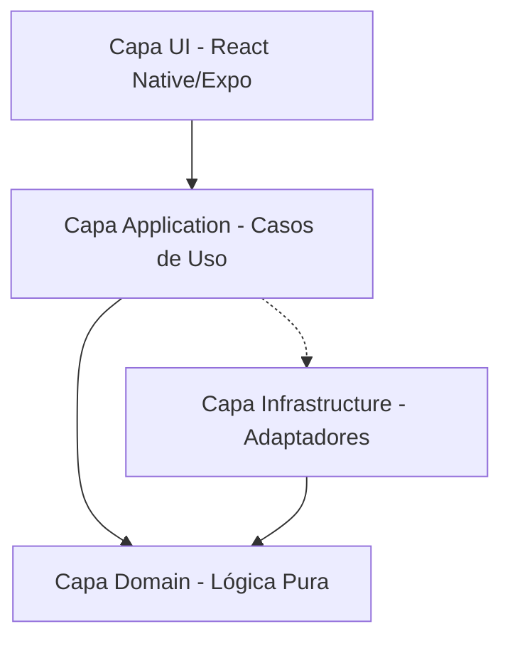
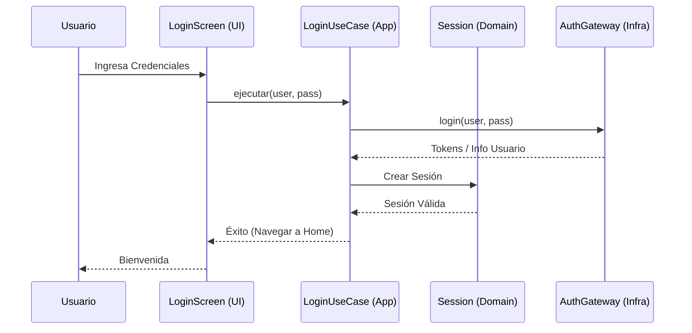

# Medá Agentes (v2) - Gestión de Migración y Harness Engineering

Este documento describe la arquitectura detallada, el estado de la migración y el marco de trabajo para agentes (Harness Engineering).

## 🚀 Estado de la Migración (Legacy -> v2)

| Módulo Legacy | Estado v2 | Capa en v2 |
| :--- | :--- | :--- |
| Login / Auth / Recovery | ✅ Migrado | `domain/auth`, `ui/features/auth` |
| Account / Profile | 🟡 En progreso | `domain/account`, `ui/features/account` |
| Notifications | 🟡 En progreso | `domain/notifications` |
| Wallet | 🟡 En progreso | `domain/wallet` |
| Support / FAQ / Help | 🟡 En progreso | `domain/support` |
| Beneficiaries | ❌ Pendiente | - |
| Fiscal | ❌ Pendiente | - |
| Prospect | ❌ Pendiente | - |
| SOD (Sistema de Operaciones) | ❌ Pendiente | - |

> [!IMPORTANT]
> El repositorio `medaapp-v2` es ahora el controlador principal de la aplicación. El código legacy se usa únicamente como referencia técnica para asegurar la paridad de reglas de negocio.

## 🏗️ Arquitectura del Sistema

Utilizamos **Arquitectura Hexagonal (Clean Architecture)** para garantizar que la lógica de negocio sea independiente de frameworks, UI y bases de datos.

### Diagrama de Capas

### Descripción de Archivos y Carpetas

- **`src/domain/`**: El corazón de la aplicación. Contiene Entidades y Puertos (interfaces). No tiene dependencias externas.
  - *¿Por qué?* Permite que la lógica sea testeable y portable a futuro (Kotlin/Swift).
- **`src/application/`**: Implementa los Casos de Uso que orquestan el dominio y los puertos.
  - *¿Por qué?* Separa la intención del usuario de la implementación técnica (ej. "Iniciar Sesión").
- **`src/infrastructure/`**: Implementaciones técnicas (Adaptadores): API REST, Almacenamiento Local, Auth real.
  - *¿Por qué?* Mantiene el framework y las librerías de terceros lejos del negocio.
- **`src/ui/`**: Componentes visuales (Atomic Design), navegación y estado de UI.
  - *¿Por qué?* Centraliza todo lo que el usuario ve y toca.
- **`src/composition/`**: Contenedor de Inyección de Dependencias.
  - *¿Por qué?* Aquí se "ensambla" toda la aplicación (une puertos con adaptadores). Es el único lugar con acoplamiento total.
- **`src/config/`**: Variables de entorno y constantes globales.
  - *¿Por qué?* Control centralizado de configuraciones.

## 🔄 Flujos Críticos (Diagramas de Secuencia)

### Flujo de Autenticación (Login)

## 🛠️ Harness Engineering (Sistema de Agentes)

Para asegurar la calidad y el detalle en cada revisión, implementamos un sistema de **Harness Engineering**.

### Roles de Agentes

1.  **Orquestador (Lead Agent)**:
    - **Responsabilidad**: Recibir requerimientos de alto nivel, planificar la ejecución y delegar subtareas.
    - **Output**: Plan de acción consolidado.
2.  **Sub-agente Reviewer**:
    - **Responsabilidad**: Revisión profunda de código, cumplimiento de linting y patrones arquitectónicos.
3.  **Sub-agente Migrator**:
    - **Responsabilidad**: Analizar discrepancias entre el repo legacy (`medaapp`) y el nuevo (`medaapp-v2`).
4.  **Sub-agente Tester**:
    - **Responsabilidad**: Generación y ejecución de tests unitarios y de integración.

### Proceso de Revisión

1.  **Activación**: El Orquestador analiza el `AGENTS.md` para conocer las reglas vigentes.
2.  **Análisis Legacy**: El Migrator escanea el archivo correspondiente en el repo antiguo.
3.  **Implementación/Mejora**: El Orquestador propone el cambio en `v2`.
4.  **Validación**: Reviewer y Tester confirman que el código es robusto y cumple la arquitectura.

---

*Última actualización: 2026-06-09*
